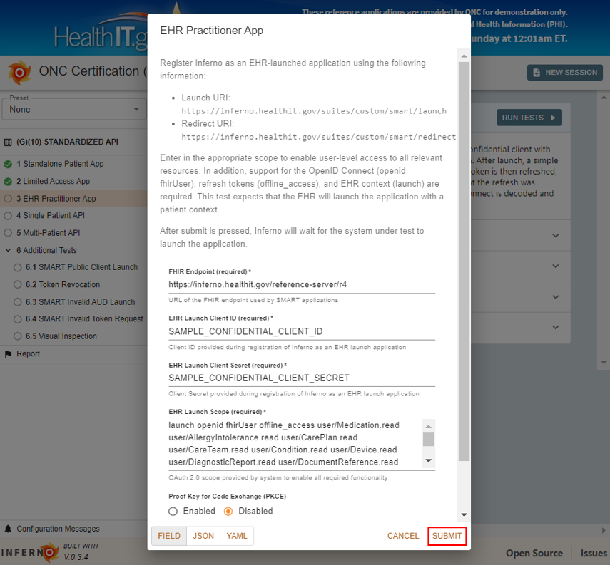
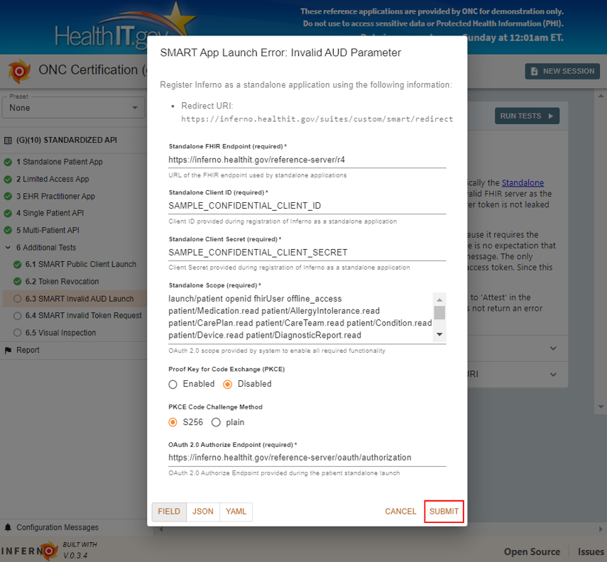

# Inferno Walkthrough

This **Walkthrough** introduces Inferno by demonstrating its use as an automated testing tool for the [Draft Test Method](https://www.healthit.gov/topic/certification-ehrs/onc-health-it-certification-program-draft-test-method) of the [21st Century Cures Act: Interoperability, Information Blocking, and the ONC Health IT Certification Program](https://www.govinfo.gov/content/pkg/FR-2019-03-04/pdf/2019-02224.pdf). It uses the ONC-hosted Inferno reference instance to test against a publicly available SMART-on-FHIR sandbox.

At the end of this walkthrough, you will be able to use Inferno's draft ONC Program Certification tests to evaluate APIs for conformance to the Proposed ONC certification criteria. If you are interested in how to use Inferno to test other FHIR-based data exchanges that fall outside the scope of ONC's proposed rule, please visit [Extending Inferno](extending-inferno) in this wiki.

Please note that Inferno is undergoing active development. Updates to Inferno can be followed on the [Inferno Release Page](https://github.com/onc-healthit/inferno-program/releases).

* [Step 1: Open Inferno](#step-1-open-inferno)
* [Step 2: Preset Inferno Reference Server (optional)](#step-2-preset-inferno-reference-server-optional)
* [Step 3: Perform Standalone Patient App Tests](#step-3-perform-standalone-patient-app-tests)
* [Step 4: Perform Limited Access App Tests](#step-4-perform-limited-access-app-tests)
* [Step 5: Perform EHR Practitioner App Tests](#step-5-perform-ehr-practitioner-app-tests)
* [Step 6: Perform Single Patient API Tests](#step-6-perform-single-patient-api-tests)
* [Step 7: Perform Multi-Patient API Tests](#step-7-perform-multi-patient-api-tests)
* [Step 8: Perform Additional Tests](#step-8-perform-additional-tests)

## Step 1: Open Inferno

* Go to https://inferno.healthit.gov.
* Select '(g)(10) Standardized API Test Kit' under 'ONC HOSTED TESTS AND UTILITIES', which is an instance of Inferno configured to specifically test the requirements of the criteria in the ONC proposed rule.

## Step 2: Preset Inferno Reference Server (optional)

Inferno provides a reference set of tests for FHIR R4. You may use this to test your own FHIR endpoint, or test against the preset Inferno Reference Server. If you would like to test against the preset server, click 'None' under 'Preset' in the upper left corner and select 'Inferno Reference Server'. Then, click 'Standalone Patient App - Full Access' to proceed to the first tests.

## Step 3: Perform Standalone Patient App Tests

Inferno's tests for the ONC certification criteria are organized into six steps. This allows the tester to walk through the requirements in an order similar to what would be done in a real-world situation, while limiting redundant testing.

The first step, 'Standalone Patient App', demonstrates the ability of a system to perform a Patient Standalone Launch to a SMART on FHIR confidential client with a patient context, refresh token, and OpenID Connect (OIDC) identity token. After launch, a simple Patient resource read is performed on the patient in context. The access token is then refreshed, and the Patient resource is read using the new access token to ensure that the refresh was successful. The authentication information provided by OpenID Connect is decoded and validated, and simple queries are performed to ensure that access is granted to all USCDI data elements.

* Click 'RUN TESTS'. You will be presented with a modal that provides necessary registration information for Inferno. If you opted to test Inferno against the Inferno Reference Server, these modal fields will be filled out with the Inferno reference server information.

* Register Inferno as a standalone application for your FHIR server.
* In the Inferno modal, provide both the Standalone Client ID and Standalone Client Secret, and click 'SUBMIT'.
* The tests start executing until user input is required. A 'User Action Required' modal will appear to ask if Inferno can redirect to the FHIR server's authorization page. Click 'Follow this link to authorize with the SMART server'.

* From here you should follow the FHIR server's authorization process.  

* For the Inferno reference server:
  * Select a Patient.

* Keep all scopes checked, and click 'Authorize'.

The authorization process should redirect you back to Inferno, which will continue executing the tests.

You should be able to view the results of the 'Standalone Patient App' tests here.

* Inferno provides in-depth information about what occurred during the course of the tests to help debug any possible errors. This includes pass/fail status on any given test, a list of errors, HTTP requests made during the course of the test, and a detailed test description.
* Click the arrow highlighted below next to 'SMART on FHIR Discovery', then the arrow next to 'About SMART on FHIR Discovery' to view information about this test suite. You can also click the arrows next to specific tests within a suite (e.g. test 1.1.01 below), then on 'ABOUT' to learn about that specific test.

* You have now completed your first test.

## Step 4: Perform Limited Access App Tests

After you have finished reviewing the results from the 'Standalone Patient App' tests, click on the 'Limited Access App' tab on the sidebar to progress to the next step in the test procedure. This scenario demonstrates the ability to perform a Patient Standalone Launch to a SMART on FHIR confidential client with limited access granted to the app based on user input. The tester is expected to grant the application access to a subset of desired resource types, and to deny requests for “offline_access” refresh tokens.

* Click on the 'Run Tests' button to begin.

* Note the resources listed in the Expected Resource Grant for Limited Access Launch.

*  Once you click 'SUBMIT', similar to the Standalone Patient App tests, Inferno will notify you that it is redirecting you to the Authorization server as part of the SMART on FHIR / OAuth launch sequence. Click 'Follow this link to authorize with the SMART server' to redirect to the FHIR server's authorization process.

* From here you should follow the FHIR server's authorization process.  

For the Inferno reference server:

* Select a Patient.

* Deselect all scopes except for `launch/patient`, `patient/Condition.read`, `patient/Observation.read`, and `patient/Patient.read` (the resources listed in the Expected Resource Grant for Limited Access Launch in the previous step), and click 'Authorize'.

The authorization process should redirect you back to Inferno, which will continue executing the tests.

## Step 5: Perform EHR Practitioner App Tests

Continue on to the 'EHR Practitioner App' set of tests. This set of tests requires the user to initiate an app launch outside of Inferno in order to fully demonstrate the ability of the server to support the EHR Launch flow as described in the SMART App Launch Guide. Inferno tests this by pausing this set of tests mid-execution, and waits at the specified launch point for the user to initiate the launch sequence from the EHR. This action will then inform Inferno that the test may continue running, with information provided during the launch.

* Click 'RUN TESTS'.

* The EHR Practitioner App modal should appear. Provide EHR Launch Client ID and EHR Launch Client Secret (prefilled if testing against the Inferno Reference Server).
* Click 'SUBMIT' to begin the tests.

* The tests will begin executing and immediately the interface will notify the user that Inferno needs to receive an external action in order to continue. In this case, Inferno is waiting for the user to initiate an app launch from the EHR.

* Launch the app from your EHR from the provided app.  

For the Inferno reference server:
* Go to https://inferno.healthit.gov/reference-server/app/app-launch.
* Enter in the provided launch URI, https://inferno.healthit.gov/suites/custom/smart/launch.
* Click 'Launch App'.

* From this point on, the tests will execute in a similar manner to the 'Standalone Launch' sequence provided earlier.
* And finally, results will be displayed in a similar manner to the previous test groups.

## Step 6: Perform Single Patient API Tests

At this point, the user should have received a Patient ID and be authorized to perform the required FHIR queries on the FHIR server. Click on the 'Single Patient API' tab to begin testing that capability.

* Click 'RUN TESTS'.
* The user will be shown the Access Token collected earlier, as well as the Patient ID returned *on the most recent SMART Launch*. This may have been either the Standalone Launch or Patient launch -- this set of tests currently does not require users to demonstrate all of these queries in both situations.

* Click 'SUBMIT'.
* After running these tests, you will be presented with the test results. These tests typically follow this pattern:
  * Ensure that the user does not have access to searching without the appropriate authorization header.
  * Perform a FHIR search for all resources of a certain type that are associated with the relevant patient.
  * For each of the filtered searches required by US Core / Argonaut, generate search queries that should return at least one result based on data that has already been seen, and verify that all data returned falls within the search criteria.
  * Validate all resources returned against the relevant profile.  This includes validating that codes are within required ValueSets.
  * Ensure that all references contained within the resource can be retrieved.
* Note: if the selected patient does not include all required resources, then some tests will be marked as 'SKIP'. The tester can then execute one of the Launch Sequence tests and authorize another patient, and only execute the tests that were previously skipped. This allows the test system to have the flexibility to demonstrate that all data can be returned, without requiring a single patient to have all required data elements.

## Step 7: Perform Multi-Patient API Tests

The Multi-Patient Authorization and API tests demonstrate the ability to export clinical data for multiple patients in a group using FHIR Bulk Data Access IG. This test uses Backend Services Authorization to obtain an access token from the server. After authorization, a group level bulk data export request is initialized. Finally, this test reads exported NDJSON files from the server and validates the resources in each file. To run the test successfully, the selected group export is required to have every type of resource mapped to USCDI data elements. Additionally, it is expected the server will provide Encounter, Location, Organization, and Practitioner resources as they are referenced as 'must support' elements in required resources.

* Click 'RUN TESTS'. The Multi-Patient Authorization and API Modal will appear.

 * Fill Bulk Data FHIR URL, Backend Services Token Endpoint, Bulk Data Client ID, Bulk Data Scopes, and Group ID.
 * Click 'SUBMIT'.

## Step 8: Perform Additional Tests

Not all requirements that need to be tested fit within the previous scenarios. The tests contained in this section address remaining testing requirements. Each of these tests needs to be run independently. Please read the instructions for each in the ‘About’ section, as they may require special setup on the part of the tester.

In this test, each section is run separately.

* **Public Client Standalone Launch with OpenId Connect**. Register Inferno as a public client with patient access and execute standalone launch.
  * Click 'RUN TESTS'.
  * Fill out the Public Client Standalone Launch with OpenID Connect Modal.
  * Click 'SUBMIT'.
  * Follow the Redirect Authorization process similar to the Standalone Patient App Tests.

* **Token Revocation**. This test demonstrates the Health IT module is capable of revoking access granted to an application. This test relies on the user to verify that the token was revoked.
  * Click on 'RUN TESTS'.
  * Revoke a Token through the EHR. For the Inferno Reference Server:
    * Fill out the Token Revocation modal with the correct FHIR Endpoint, OAuth 2.0 Token Endpoint, and the Revoked Bearer Token and Corresponding Refresh Token. Change the 'Prior to executing test, Health IT developer demonstrated revoking tokens provided during patient standalone launch' field to 'Yes', and copy the Revoked Bearer Token highlighted below.

  * Go to https://inferno.healthit.gov/reference-server/oauth/token/revoke-token in another tab and insert the copied Token value from the modal into the text input and click 'Revoke'. This will also revoke the corresponding refresh token.

  * Return to the Token Revocation modal and click 'SUBMIT'.

* **SMART Invalid AUD Launch**. The purpose of this test is to demonstrate that the server properly validates the AUD parameter.
  * Click 'RUN TESTS'.
  * Fill out the SMART App Launch Error: Invalid AUD Parameter modal.

  * Click 'SUBMIT'. The Test Running modal will appear.

  * Right click 'Perform Invalid Launch' and select 'Open link in new tab', which will redirect you to the FHIR server's authorization process. The purpose of this test is to confirm that the FHIR server does NOT return back to Inferno, but instead displays an error message indicating that the AUD value is invalid.
  * For example, with the Inferno reference server:

  * As soon as you have confirmed that the redirect displays an error, return to your Inferno tab and click 'Attest launch failed' to complete the test.

* **SMART App Launch Error: Invalid Access Token Request**. The purpose of this test is to demonstrate that the server properly validates access tokens.
  * Click 'RUN TESTS'.
  * Fill out the SMART App Launch Error: Invalid Access Token Request modal.

  * Click 'SUBMIT'.
  * The 'User Action Required' modal will appear. Launch from your EHR with the provided launch URI, similar to the EHR Practitioner App Tests.
  * Launch the app from your EHR from the provided app. For the Inferno reference server:
    * Go to https://inferno.healthit.gov/reference-server/app/app-launch.
    * Enter in the provided launch URI, https://inferno.healthit.gov/suites/custom/smart/launch.
    * Click 'Launch App'.
  * Click 'Follow this link to authorize with the SMART server', and follow steps to authorize similar to the Standalone Patient App tests. After you click 'Authorize' you will be redirected to the Inferno page, where the test will complete.

* **Visual Inspection And Attestation**. The purpose of this test is to verify conformance to portions of the test procedure that are not automated.
  * Click 'RUN TESTS'.
  * The 'Visual Inspection and Attestation modal will appear, with a list of Yes/No radio buttons and text boxes for Notes. Fill out this form, and click 'SUBMIT'.

  * All tests are now complete.

